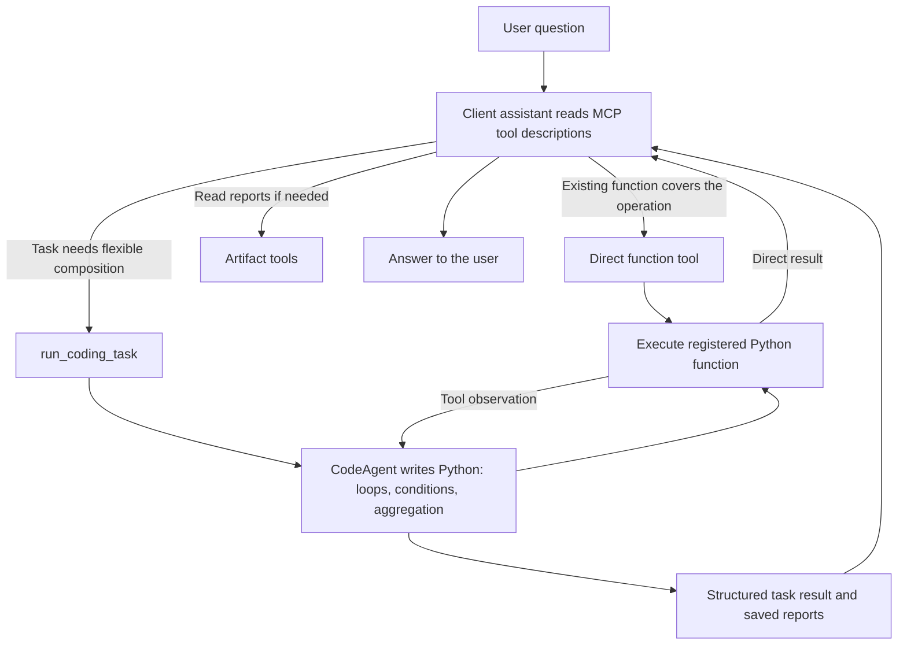
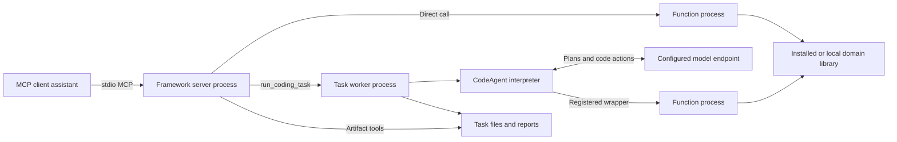

# Quant MCP framework

Expose selected functions from your existing Python library as MCP tools. For tasks
that need several operations, an internal smolagents CodeAgent writes Python that
combines **the same registered functions**.

Your domain code stays in your own package. `src/` contains the framework;
[`examples/pricing/`](examples/pricing/) is a separate example library, excluded
from the installed framework package.

This README is the single maintained guide for using and operating the framework.
Runnable examples remain in `examples/`; their instructions are included below.

- [Quick start](#quick-start-run-the-included-example)
- [Pre-flight check](#pre-flight-check)
- [Request workflow](#what-happens-when-a-user-asks-a-question)
- [Integrate your own library](#integrate-your-own-library)
- [Model configuration](#configure-the-model)
- [MCP tools, results and artifacts](#mcp-tools-and-task-results)
- [Logging and OpenTelemetry](#logging-and-tracing)
- [Pricing example](#pricing-example)
- [Technical architecture](#technical-architecture)
- [Deployment boundaries](#deployment-boundaries)
- [Development](#development)
- [Troubleshooting](#troubleshooting)

## Register once, use two ways

```python
from quant_mcp.framework import MCPFramework
from office_library import price_trade, calculate_risk

app = MCPFramework("office-analytics", artifacts_dir="./artifacts")
app.expose(price_trade, read_only=True)
app.expose(calculate_risk, read_only=True)

if __name__ == "__main__":
    app.run()
```

Here `office_library` represents your own importable package. Each `app.expose(...)`
uses the function's type hints and docstring to advertise an MCP tool and records
that function for the coding agent. No repository scan or codebase YAML is needed.
The server also adds a coding-task tool and result/artifact readers automatically.

## Quick start: run the included example

Use Python 3.11+ and `uv` on macOS/Linux. From this repository:

```bash
uv sync --group examples
```

Check startup before connecting a client:

```bash
uv run --group examples python examples/framework_server.py --check
```

The check prints a report and exits. See [pre-flight options](#pre-flight-check)
for agent requirements, timeouts and machine-readable output.

Direct tools work without model credentials. For coding tasks, create `.env` from
[`.env.example`](.env.example) if you do not already have one, then set the model
credentials. The example explicitly loads this file; existing environment values
have priority. See [model configuration](#configure-the-model).

Configure your MCP client to launch the example with the environment's Python.
For clients using an `mcpServers` JSON configuration, the entry looks like this;
replace both absolute paths:

```json
{
  "mcpServers": {
    "pricing-example": {
      "command": "/absolute/path/to/quant-mcp-poc/.venv/bin/python",
      "args": ["/absolute/path/to/quant-mcp-poc/examples/framework_server.py"]
    }
  }
}
```

This launches a **stdio MCP server**, not an interactive terminal chat. No network
port is opened by default. An equivalent launch from the repository is:

```bash
uv run --group examples python examples/framework_server.py
```

Normally, let the MCP client launch the server using the configuration above;
you do not need to start a separate server in a terminal. If you run the command
manually, it displays a terminal notice and then waits for protocol messages.
There is no chat prompt or browser page. **Do not type text or press Enter**:
even a blank line is sent to the JSON-RPC parser and produces an `Invalid JSON`
error. Send questions through your connected MCP client instead.

The client should discover `price_option_t`, `calc_greeks_t`, and the [five built-in
tools](#mcp-tools-and-task-results). Try a [direct calculation, then a scenario report](#pricing-example).

## Pre-flight check

For the included example, use `--check` with the usual server command:

```bash
uv run --group examples python examples/framework_server.py --check
```

This diagnostic command prints `PASS`, `WARN`, `FAIL` or `SKIP` for each check and
exits. It does not leave a server running or wait for terminal input. A successful
report includes a **real MCP initialize, ping and tools/list exchange**, not just
an import check.

| Check | What it verifies |
| --- | --- |
| Python and dependencies | Interpreter path/version, POSIX support and installed core package versions. |
| Application and registration | Entry-point imports, the framework application variable, tool schemas and exposed tool names. |
| Worker imports | Registered functions import in a fresh Python process with a temporary working directory. Function bodies are not executed. |
| Artifact storage | The configured directory can be created and written to; the temporary test file is removed. |
| Coding-agent settings | smolagents/OpenAI imports, API-key presence, endpoint URL syntax, model settings and valid numeric budgets. Key values are not printed. |
| Telemetry setup | The application's optional setup hook completes during startup. Exporter/backend delivery is not tested. |
| MCP stdio | The real entry point starts, completes the handshake and advertises the expected tools. Non-JSON stdout is a failure. |

Missing or broken smolagents/OpenAI dependencies fail the check because they are
required framework dependencies. Missing model credentials produce warnings by
default; direct functions can still work without a model API key. Require locally
valid agent configuration with:

```bash
uv run --group examples python examples/framework_server.py --check --require-agent
```

For your own application, use the reusable framework command with the same Python
environment and working directory your MCP client uses:

```bash
python -m quant_mcp.preflight /absolute/path/to/office_server.py
python -m quant_mcp.preflight /absolute/path/to/office_server.py --require-agent --timeout 60 --json
```

The entry point must expose a module-level `MCPFramework` instance named `app`
(or specify `--app your_variable`) and guard `app.run()` with
`if __name__ == "__main__":`. The checker imports that application in a subprocess,
so its explicit `.env` loading and telemetry setup are exercised. It then starts
the entry point normally as a stdio server. HTTP/SSE entry points are outside this
check's scope. `--check` is a convenience implemented by the included example;
custom entry points can use the module command without modification.

`--timeout` defaults to 30 seconds per inspection/protocol stage, accepts values
greater than zero up to 300, and bounds blocked imports or an unresponsive server.
Process cleanup can add a short delay. Exit code **0** means no failing checks
(warnings may remain); **1** means a failed check; **2** means invalid CLI usage.
`--json` emits one JSON report with `ok`, `server`, `checks` and `diagnostics_dir`.

Failures include a suggested fix. Detailed import/startup/protocol output is saved
in a private temporary diagnostic directory, whose path appears in the report.
These files may contain sensitive output from your libraries; inspect them locally
and redact them before sharing. They remain available after the check and can be
deleted when you finish debugging.

The checker does not invoke registered tools, send a model request, or test model
authentication, model availability, external services or numerical correctness.
Application/module import code and telemetry hooks still execute and may have
their own side effects. A `PASS` establishes local startup/protocol readiness;
it does not prove that a later business calculation or model API call will succeed.

## Deterministic MCP tool tests

Projects built on this framework can run protocol-level tool tests without a chat
application. The test runner launches the server as a child process, connects over
stdio, performs the MCP handshake, discovers tools, invokes scenarios, and writes
an exit status suitable for CI.

The reusable implementation lives in `quant_mcp.testing`. A project supplies a
server launch configuration and a JSON or YAML scenario suite. JSON needs no extra
package; YAML support is available with `uv sync --extra testing`.

Run the included pricing suite:

```bash
uv sync --group examples --extra testing
uv run quant-mcp-test \
  --config tests/mcp/server.json \
  --suite tests/mcp/pricing.json \
  --output artifacts/mcp-test-report.json
```

The server configuration describes the local stdio command:

```json
{
  "server": {
    "command": "uv",
    "args": ["run", "--group", "examples", "python", "examples/framework_server.py"],
    "cwd": "../..",
    "startup_timeout_seconds": 30,
    "call_timeout_seconds": 30
  }
}
```

Scenario assertions support successful/error responses, text fragments, nested
structured content, and numeric tolerances. The expected tool list is treated as
a required subset, which allows framework-provided tools to remain available.
The runner reports startup duration and per-tool-call duration in its JSON report.

Suites can also define schema contracts and reliability cases. Schema contracts
check stable parts of `tools/list` without requiring an exact match for every
framework-provided tool:

```json
{
  "tool_contracts": {
    "price_option_t": {
      "required": ["option_type", "spot", "strike", "time_to_expiry", "volatility", "rate"],
      "properties": {
        "spot": {"type": "number"}
      },
      "read_only": true
    }
  }
}
```

Use `is_error` and `error_contains` for validation failures, `type: "concurrent_tool"`
with `requests` and `max_concurrency` for concurrent calls, and
`expect_timeout: true` for an intentionally bounded call:

```json
{
  "id": "reject-invalid-input",
  "tool": "price_option_t",
  "arguments": {"volatility": -0.2},
  "assertions": {
    "is_error": true,
    "error_contains": ["Error executing tool"]
  }
}
```

Suites can also contain prompt scenarios. These test client behavior rather than
the server's business functions:

```json
{
  "id": "unsupported-weather-question",
  "type": "prompt",
  "prompt": "What's the weather in Singapore?",
  "replay": {
    "response": "I cannot answer weather questions because live weather data is unavailable.",
    "tool_calls": []
  },
  "assertions": {
    "expected_tool_calls": [],
    "response_policy": "refuse_or_explain"
  }
}
```

Prompt scenarios can embed deterministic replay data in the same suite file. For
real model/client testing, pass `--prompt-adapter module:attribute`. The adapter
returns the final response and observed tool calls. This keeps the core test runner
independent of any model provider.

## What happens when a user asks a question?

There are two AI roles: the **client assistant** the user talks to, and the
**internal coding agent** that runs only when `run_coding_task` is called.



**The client assistant chooses the path.** The server executes the selected MCP
tool; it does not contain a question classifier or automatically escalate a failed
direct call to the agent. Users can explicitly ask the client to use a particular
tool. The client can also compose a few direct calls itself.

| User request | Typical path | Reason |
| --- | --- | --- |
| “Price this trade with these inputs.” | Direct function | A registered function already does the requested operation. |
| “Run the full portfolio risk calculation.” | Direct function, if available | A complex calculation can still be one existing function call. |
| “Compare five scenarios across these trades and save a report.” | `run_coding_task` | Python can coordinate repeated calls, comparisons and reporting. |
| “Explain what this returned value means.” | Client assistant answers | Another calculation may not be needed. |

A direct call validates inputs, executes your function in a child process and
returns its result. It makes **no internal model call**.

For a coding task, CodeAgent receives the exposed function names, schemas and
docstrings. It writes and executes Python, inspects observations, and can repair
errors. Variables persist between its code actions within that task. It calls
function wrappers directly—there is no MCP round trip back to its own server—and
can save reports with artifact helpers. It does not browse repositories or import
your office modules into its code interpreter. Your function implementations still
run as normal Python in child processes.

## Integrate your own library

### Install in your application environment

Use Python 3.11+ on macOS/Linux. Install the framework and your office package into
**the same Python environment**. From an activated virtual environment:

```bash
python -m pip install -e '/absolute/path/to/quant-mcp-poc'
python -m pip install -e /absolute/path/to/office-library
```

The framework is imported as `quant_mcp`; its distribution name is `quant-mcp-poc`.
smolagents and its OpenAI client are installed by default. Configure model
credentials to use coding tasks; direct functions and artifact access do not
require a model API key.

An office library may be an installed package, a Git submodule, or a local module
beside your server entry point. A Git submodule supplies files, not installed
Python dependencies. There is no source-directory YAML to configure.

### A complete minimal application

These two files can live in your own application directory. The first represents
your existing library; it has no MCP or smolagents dependency.

**`office_tools.py`**

```python
def position_value(
    quantity: float,
    unit_price: float,
    multiplier: float = 1.0,
) -> dict[str, float]:
    """Return signed position value in the same currency as unit_price.

    quantity is positive for long positions and negative for short positions.
    unit_price is currency per unit. multiplier is units per contract.
    Returns {"value": quantity * unit_price * multiplier}.
    Example: quantity=2, unit_price=3.5, multiplier=100 returns value=700.
    """
    return {"value": quantity * unit_price * multiplier}
```

**`office_server.py`**

```python
from pathlib import Path

from office_tools import position_value
from quant_mcp.config import load_env_file
from quant_mcp.framework import MCPFramework

ROOT = Path(__file__).resolve().parent
load_env_file(ROOT / ".env")  # Optional; no error if the file is absent.

app = MCPFramework(
    "office-analytics",
    artifacts_dir=ROOT / "artifacts",
    max_concurrent_calls=2,
    max_timeout_seconds=300,
)
app.expose(position_value, read_only=True, timeout_seconds=60)

if __name__ == "__main__":
    app.run()
```

Point your MCP client at this environment's Python and the absolute path to
`office_server.py`, using the [client configuration above](#quick-start-run-the-included-example).
Register all functions before `app.run()`. Restart the server and refresh the
client's tools after changing registrations or signatures.

For a direct call, the client sends `position_value` these arguments:

```json
{"quantity": 2, "unit_price": 3.5, "multiplier": 100}
```

The result is `{"value": 700.0}`. For a composed task, ask the client to use
`run_coding_task` to compare multiple prices and save a CSV. Function registration
is shared, so there is no second list of tools to maintain for the agent.

### Function contract

| Requirement | Guidance |
| --- | --- |
| Importable function | Use a top-level function in a module/package, not a function defined in `__main__`, a closure or a bound method. |
| Named, typed arguments | Annotate every parameter and the return value. Positional-only parameters, `*args` and `**kwargs` need a wrapper. |
| Useful docstring | State what it does, when to use it, argument units, sign conventions, defaults, return keys and relevant errors. Both assistants depend on this information. |
| Serializable values | Return JSON-compatible values or Pydantic models. Convert DataFrames/custom objects in a thin wrapper. |
| Sync or async | Both are supported. Each call starts a fresh process; pass identifiers/data rather than live connections or objects. |
| Explicit data locations | Workers use temporary working directories. Do not rely on the server's current directory for input files. |

Use `app.expose(function, name="tool_alias")` to publish the same alias to MCP and
the agent. Names must be valid Python identifiers. Duplicate names, built-in MCP
names, `final_answer`, `write_artifact` and `read_written_artifact` are reserved.

For a class-based library, create a top-level function that constructs the object,
calls its method and returns serializable data. Avoid printing or other side
effects during module import; imports also occur in worker processes.

`read_only=True` is a hint to MCP clients, not an access-control mechanism. Mark it
only when the function does not change external state. Registration exposes that
function to both paths; the current API has no MCP-only or agent-only switch.

## Configure the model

The internal agent needs credentials independently of the client assistant. Direct
function calls do not use these credentials or invoke the internal model.

Choose a model and compatible chat-completions endpoint approved for your data:

```dotenv
SMOLAGENTS_API_KEY=your-key
SMOLAGENTS_API_BASE=https://your-approved-endpoint/v1
SMOLAGENTS_MODEL_ID=your-model-id
```

Alternatively, use the `DEEPSEEK_*` settings in [`.env.example`](.env.example).
Nonempty generic settings override the corresponding provider settings individually.
The configured DeepSeek model name is a default, not a guarantee of availability
for your account; update it to a model available at your endpoint.

| Setting | Default / fallback | Purpose |
| --- | --- | --- |
| `SMOLAGENTS_API_KEY` | `DEEPSEEK_API_KEY` | Internal model credential. |
| `SMOLAGENTS_API_BASE` | `DEEPSEEK_API_BASE`, then `https://api.deepseek.com` | Model endpoint. |
| `SMOLAGENTS_MODEL_ID` | `DEEPSEEK_MODEL`, then `deepseek-v4-flash` | Model identifier. |
| `DEEPSEEK_THINKING` | `disabled` | `enabled` or `disabled`; applied to model IDs beginning with `deepseek-`. |
| `SMOLAGENTS_MODEL_TIMEOUT_SECONDS` | `120` | Per-request model timeout, capped by the supplied task timeout. |
| `SMOLAGENTS_MAX_STEPS` | `12` | Agent action budget. |
| `SMOLAGENTS_PLANNING_INTERVAL` | `3` | Planning cadence; `0` disables extra planning calls. |
| `SMOLAGENTS_MAX_TOOL_CALLS` | `100` | Registered function call budget per task, including failed attempts. |

The framework does not search for `.env`. Call `load_env_file(path)` explicitly or
set variables in the MCP host. The loader supports simple `KEY=VALUE` lines,
comments and surrounding quotes; it is not a shell parser. Existing environment
values take priority. Keep real credentials out of version control.

## MCP tools and task results

| Tool | Arguments | Result |
| --- | --- | --- |
| Your exposed functions | Their typed parameters | The function's result, encoded by MCP. Scalar returns are wrapped in a `result` field in structured output. |
| `run_coding_task` | `prompt`, `timeout_seconds=300` | Task response after completion/failure; default timeout is capped by the server maximum. |
| `list_tasks` | `limit=20` (1–100) | Recent task IDs, including tasks without completed results. |
| `get_task_result` | `task_id` | Saved result object, up to 256 KiB inline. |
| `list_artifacts` | `task_id`, `offset=0`, `limit=100` (1–500) | File metadata and optional next page offset. |
| `read_artifact` | `task_id`, `filename`, `offset=0`, `max_bytes=65536`, `encoding="utf-8"` | Content chunk, byte size and `next_offset`. |

A coding-task response has this shape (IDs and paths below are illustrative):

```json
{
  "request_id": "...",
  "task_id": "task_...",
  "task_dir": "/server/artifacts/task_...",
  "status": "success",
  "task_type": "analysis",
  "summary": "Compared the requested positions",
  "metrics": {"total_value": 700.0},
  "assumptions": [],
  "artifacts": [{"name": "values.csv", "path": "outputs/values.csv"}],
  "worker_log": "/server/artifacts/worker_logs/....log"
}
```

`get_task_result` reads the saved result fields; `request_id`, `task_id`, `task_dir`
and `worker_log` are added by the task/transport layer, not stored in `result.json`.
Task IDs are allocated before launching the worker. Handled worker exits and
overall timeouts save a failed `result.json` and return those IDs; cancellation
saves the failure but propagates cancellation to the caller. Failures before a
worker starts, such as an unwritable artifacts directory, can raise an MCP error.

Check **both `status` and `task_type`**:

| `task_type` | `status` | Meaning |
| --- | --- | --- |
| `analysis` | `success` | Validated answer format and at least one successful registered call. Numerical correctness is not proven. |
| `no_action` | `success` | A conversational or conceptual answer without function execution. |
| `needs_input` | `success` | The agent needs information; the requested analysis is not completed. |
| `unsupported` | `failed` | Required capabilities are unavailable. |
| `failed` | `failed` | Execution, configuration, deadline or agent failure. |

These task types are model decisions constrained by final-answer checks. They are
not a deterministic classifier. A direct tool error does not automatically start
a coding task; the client decides what to do next.

### Retrieve a report

Read the returned relative artifact path through MCP, not by trying to open the
server's absolute path on the client machine. For example, call `read_artifact`:

```json
{"task_id": "task_...", "filename": "outputs/values.csv"}
```

Read subsequent chunks at `next_offset` until it is `null`. Offsets are **bytes**,
including for UTF-8 text. For a PDF, image or spreadsheet, use `encoding="base64"`,
decode each chunk, and concatenate the decoded bytes. Do not concatenate padded
base64 strings and decode them as one string. Chunks are capped at 256 KiB.

`list_artifacts` lists reports and diagnostic files, not just final deliverables.
The agent's writer saves reports under `outputs/` with a 1 MiB per-file limit;
the model must supply the text/base64 content. The artifact helpers do not provide
an automatic document renderer. Large task results can be read as chunked
`result.json` if they exceed `get_task_result`'s inline limit.

## Logging and tracing

The framework uses **OpenTelemetry for traces** and **Python logging for live
progress**. Progress files work immediately without an SDK or backend. To export
spans, your application configures the SDK in the server and its workers.

The logs record the tool the client selected and the resulting execution. They
do not contain the client's reasoning or chat messages outside tool calls.

### Watch progress without a backend

After the first tool call, run this on the server, substituting your configured
`artifacts_dir` if different:

```bash
tail -f artifacts/events.jsonl
```

Each line includes a UTC timestamp, request ID, event and mode. For example:

```json
{"timestamp":"2026-09-20T08:15:30.123Z","event":"request_started","request_id":"abc123","mode":"direct","tool":"position_value","task_id":null,"trace_id":null,"span_id":null}
```

This abbreviated example has no SDK configured. Actual records also contain
`event_id` and `pid`. When a recording SDK is configured, OpenTelemetry supplies
`trace_id` and `span_id`, allowing you to jump from logs to a trace backend.
A propagated, non-recording context can also supply IDs even without local export.

| Field | Meaning |
| --- | --- |
| `request_id` | Framework ID for one MCP tool call, retained across workers. Separate from an OTel trace ID, MCP JSON-RPC ID or chat ID. |
| `mode` | `direct`, `coding_agent`, `artifact`, or `unknown` for an unregistered tool. |
| `tool` | Incoming MCP tool name; stays `run_coding_task` throughout its agent work. |
| `task_id` | Coding-task directory ID, allocated before launching the task worker. |
| `trace_id`, `span_id` | Current OpenTelemetry context, captured before the log crosses the logging queue. |
| `function`, `call_id` | Particular function invocation inside the request/task. |
| `status`, `duration_ms` | Outcome and elapsed time on completion events where applicable. |

`request_started` marks entry into the tool handler, before argument validation.
It is not the network packet arrival time. Initialization, tool listing and
malformed protocol messages are outside this instrumentation.

Coding-task responses include `request_id` and `task_id`. Direct return values
remain unchanged; find IDs in arrival events or the call ID in an execution error.
Filter a request's existing events with:

```bash
rg 'abc123' artifacts/events.jsonl
```

### Enable OpenTelemetry

Install the optional SDK and OTLP/HTTP exporter:

```bash
uv sync --extra telemetry --group examples
```

For an installed package, the corresponding extra is `quant-mcp-poc[telemetry]`.
The framework itself depends only on `opentelemetry-api`. It does not install a
global provider, choose a backend or open a telemetry connection by default.

Create an application module such as `office_telemetry.py`:

```python
import sys
from opentelemetry import trace
from opentelemetry.sdk.resources import Resource
from opentelemetry.sdk.trace import TracerProvider
from opentelemetry.sdk.trace.export import BatchSpanProcessor, ConsoleSpanExporter

def configure():
    provider = TracerProvider(
        resource=Resource.create({"service.name": "office-analytics"})
    )
    provider.add_span_processor(
        BatchSpanProcessor(ConsoleSpanExporter(out=sys.stderr))
    )
    trace.set_tracer_provider(provider)
```

Then pass its import path in your application's server setup:

```python
app = MCPFramework(
    "office-analytics",
    artifacts_dir=ROOT / "artifacts",
    telemetry_setup="office_telemetry:configure",
)
```

The hook must be an importable, no-argument function. The framework calls it once
per hook per process, including fresh task/function workers. Keep this module
available in the same environment as the application. It should only configure
telemetry, never start a server or run business work.

Setting a provider only inside the server's `__main__` block does **not** configure
fresh subprocesses. Applications that already configure providers through an
external bootstrap can omit the hook, provided that bootstrap also runs in every
worker. Do not install competing global providers; let your application own one.

For a backend, replace the console exporter in the hook with
`opentelemetry.exporter.otlp.proto.http.trace_exporter.OTLPSpanExporter()` and set
standard OpenTelemetry environment variables, for example:

```bash
export OTEL_EXPORTER_OTLP_TRACES_ENDPOINT=http://localhost:4318/v1/traces
export OTEL_SERVICE_NAME=office-analytics
```

This assumes a compatible collector/backend is already listening there. The
explicit `service.name` in the sample hook takes precedence over the environment;
remove it or read `OTEL_SERVICE_NAME` in the hook if you prefer environment control.
Configure authentication through the exporter's standard environment settings.
The framework does not launch a collector or require a particular vendor.

The runnable example already includes
[`telemetry_config.py`](examples/telemetry_config.py). Set
`QUANT_MCP_TRACE_EXPORTER=console` for stderr spans or `otlp` for OTLP/HTTP. This is
an **example application setting**, not a framework-wide environment switch.
For MCP clients, pass it in the server configuration's `env` object. Without the
selector, the example keeps progress logs but does not configure an SDK.
For example, after installing the extra:

```bash
QUANT_MCP_TRACE_EXPORTER=console uv run --extra telemetry --group examples python examples/framework_server.py
```

For an MCP client, add `"env": {"QUANT_MCP_TRACE_EXPORTER": "console"}` to its
server configuration entry.

**Never send console telemetry to MCP stdout.** The sample explicitly uses
stderr. Worker stderr is captured in worker/function diagnostic logs; an OTLP
exporter sends all processes to the same backend. `app.run()` and workers flush
exporters on normal completion/shutdown. Embedded applications own their SDK
lifecycle; they can call their provider's `force_flush()` before shutting down.

### What the trace shows

A span represents a timed operation. A coding-task trace has this structure:

```text
mcp.tool.call                 SERVER span, mode=coding_agent
└── task.worker               Parent supervises the subprocess and deadline
    └── agent.run             CodeAgent execution in the worker
        ├── model.generate    Model generation (including planning calls)
        ├── function.call     Registered function invocation
        │   └── library.function   Execution in its function subprocess
        │       └── ...      Any OTel spans your office library creates
        └── model.generate    Further model calls as needed
```

A direct call has `mcp.tool.call → function.call → library.function`, without an
agent or model span. Artifact readers get an `mcp.tool.call` span with
`mode=artifact`. Unknown tools and invalid arguments also finish a request span.

W3C trace context travels in the existing worker request files. Python context is
also copied into registered tool callbacks because smolagents executes generated
code in another thread. This preserves both OTel parentage and run metadata.
It does not automatically extract a remote MCP client's distributed trace context
from protocol metadata; the request joins any OTel context already active at the
handler, otherwise it starts a new trace.

Spans have metadata such as tool/function names, model identifier, execution mode
and outcome. `quant_mcp.outcome` retains application statuses; failures, timeouts,
cancellations and rejections also set the OTel error status. Successful spans
leave the standard status unset. Prompts, argument/result values and raw exception
messages are not added by the framework. Additional application instrumentors may
have different capture settings.

### Progress during a run

Standard span exporters export completed spans. Live progress therefore remains
separate from span export and works even if spans are sampled out.

A direct call emits:

```text
request_started → function_call_started → function_call_finished → request_finished
```

A coding task emits events such as:

```text
request_started
  task_created → task_worker_started → agent_started
  model_call_started → model_call_finished
  function_call_started → function_call_finished
  artifact_written
  agent_step_finished
  ... further model calls, functions or steps ...
  agent_finished → task_worker_finished
request_finished
```

Model generation events include a call counter and `streaming` flag. They do not
infer planning phases from prompt contents or stop sequences. One code step may
call many functions; failed steps can be repaired. `task_worker_finished` describes
the process exit, while `request_finished` describes the overall request outcome.
A worker can exit normally after returning a failed task result.

`request_finished.status` is `success`, `failed`, `timed_out`, `cancelled` or
`rejected`. A busy server emits `request_rejected`; validation errors finish as
`failed` without starting a function. An overall worker timeout is `timed_out`,
while an agent that catches its own deadline error may return a failed result.

### Find detailed evidence

| File under `artifacts_dir` | Contents |
| --- | --- |
| `events.jsonl` | Global live timeline, including arrival before a task ID exists. |
| `function_logs/<request_id>.log` | Direct function stdout/stderr and diagnostics. |
| `worker_logs/<request_id>.log` | Coding worker console output and diagnostics. |
| `<task_id>/events.jsonl` | Task progress from task creation through the parent's final event. |
| `<task_id>/prompt.txt` | Original coding-task prompt. |
| `<task_id>/registry.json` | Snapshot of exposed functions. |
| `<task_id>/agent_instruction.md` | Agent instructions, when initialized. |
| `<task_id>/outputs/` | Reports saved by the agent's artifact helper. |
| `<task_id>/function_calls.json` | Snapshot of function attempts; use JSONL for live monitoring. |
| `<task_id>/function_logs/<call_id>.log` | A nested function's diagnostics. |
| `<task_id>/agent_actions/action_001.py` | Code saved when an action finishes; may depend on earlier state. |
| `<task_id>/smolagents_result.json` | Detailed agent steps/observations saved during finalization. |
| `<task_id>/result.json` | Saved structured outcome. |

A downstream client can read a task's progress using the existing `read_artifact`:

```json
{"task_id":"task_...","filename":"events.jsonl"}
```

Continue at `next_offset` for large files. `run_coding_task` waits for completion;
it does not immediately return an ID for polling. Operators can obtain running
IDs from `task_created`, and concurrent clients can use `list_tasks`. Reading a
growing file gives a snapshot, not a streaming subscription. Global logs and
direct-call diagnostics remain server-side files.

`app.run()` also configures `quant_mcp.audit` to emit server progress on stderr;
MCP stdout remains reserved for protocol messages. Embedded `app.mcp` usage still
writes JSONL automatically; configure the logger separately for console output.

### Operational limits

Python's `QueueHandler`/`QueueListener` moves file writes and POSIX lock waits off
the MCP event loop. Each process has its own queue; a file handler locks and
flushes complete lines across processes. Request completion asynchronously drains
the queue, so slow storage can delay that response without blocking other
coroutines. Other application-installed logging handlers can still run synchronously.
Global/per-task writes are separate; use IDs and timestamps to correlate them,
not strict cross-process file order. No automatic rotation or retention is provided.

The logging queue is in memory and unbounded; sustained slow storage can grow
memory usage. File-write failures warn without failing an otherwise successful
business call. This is an operational log, not a durable or tamper-proof journal.

A killed process can lose queued logs, unfinished spans and buffered exporter
batches. The surviving parent records its timeout/cancellation outcome; a server
crash can prevent even that final event. There are no heartbeats or restart
recovery. Absence of a completion event is not proof that a process is still alive.

Detailed worker/model files can contain sensitive data even though framework spans
and lifecycle events omit values. Apply filesystem permissions and retention
appropriate for your application. Existing artifact access rules are unchanged.

The SDK/API split and propagation follow the official
[OpenTelemetry Python instrumentation](https://opentelemetry.io/docs/languages/python/instrumentation/)
and [context propagation](https://opentelemetry.io/docs/languages/python/propagation/)
guides. The application can use any compatible exporter/backend.

## Pricing example

The included library demonstrates European option pricing and Greeks with
supplied inputs, not live market data. Connect the example server using the
[quick start](#quick-start-run-the-included-example); coding tasks also need
[model credentials](#configure-the-model).

The entry point imports `pricing` from the sibling directory and exposes only:

| Function | Result |
| --- | --- |
| `price_option_t` | Price per share for an exact time to expiry in years. |
| `calc_greeks_t` | `delta`, `gamma`, `vega`, `theta` and `rho`, per share. |

Both accept decimal volatility/rates: `0.25` means 25%, not `25`. Vega and rho are
per 1.00 absolute change; divide by 100 for a one-percentage-point change. Theta is
per calendar day. No position quantity or contract multiplier is applied.

### 1. Ask for one direct calculation

Ask your client assistant:

> Use price_option_t directly to price a European call: spot 100, strike 100,
> time to expiry exactly 1 year, volatility 20%, continuously compounded rate 5%,
> and zero dividend yield. Return the price per share.

The MCP tool arguments are:

```json
{
  "option_type": "call",
  "spot": 100,
  "strike": 100,
  "time_to_expiry": 1,
  "volatility": 0.2,
  "rate": 0.05,
  "dividend_yield": 0
}
```

The example returns approximately 10.45 per share. This path starts a function
worker and returns its value; it does not invoke the internal coding model.

### 2. Ask the coding agent to compose functions

> Use run_coding_task to compare a European call at spots 90, 100 and 110. Use
> strike 100, time to expiry exactly 0.25 years, volatility 25%, rate 4%, and zero
> dividends for every scenario. Use the registered pricing and Greeks functions.
> Report price and delta per share, and save scenarios.csv.

The client delegates this prompt to the coding-task tool. The internal agent can
generate code like this; the actual actions depend on the model. These tool names
are injected into its interpreter, so this is **not a standalone Python script**:

```python
rows = []
for spot in [90, 100, 110]:
    price = price_option_t(
        option_type="call", spot=spot, strike=100, time_to_expiry=0.25,
        volatility=0.25, rate=0.04, dividend_yield=0,
    )
    greeks = calc_greeks_t(
        option_type="call", spot=spot, strike=100, time_to_expiry=0.25,
        volatility=0.25, rate=0.04, dividend_yield=0,
    )
    rows.append({"spot": spot, "price": price, "delta": greeks["delta"]})

csv = "spot,price,delta\n" + "\n".join(
    f"{row['spot']},{row['price']},{row['delta']}" for row in rows
)
write_artifact(filename="scenarios.csv", content=csv)
final_answer({
    "task_type": "analysis",
    "summary": "Compared three spot scenarios",
    "metrics": {"scenarios": rows},
    "assumptions": ["Other inputs held fixed; values are per share"],
})
```

The agent can spread this work across actions, retain variables, inspect results
and repair mistakes. Separate coding tasks start with fresh interpreter state.

### 3. Retrieve and inspect the output

Use the returned `task_id` to call `get_task_result` or `list_artifacts`. Read the
CSV with `read_artifact`, for example:

```json
{"task_id": "task_...", "filename": "outputs/scenarios.csv"}
```

The actual task ID comes from your run. Artifact readers return file content
through MCP, so the client does not need access to your filesystem. You can also
read `function_calls.json` to inspect which functions ran and `agent_actions/`
files to inspect generated code. Check `task_type` as well as `status`: an answer
requesting more input is not a completed calculation.

Watch `artifacts/events.jsonl` to compare `mode: "direct"` with
`mode: "coding_agent"`, or use [OpenTelemetry](#enable-opentelemetry) to inspect
the span tree. To use your office library, replace the pricing imports and
`app.expose(...)` calls in your own entry point. The example package and SciPy are
not required unless your library needs them.

## Technical architecture

The application owns its domain functions and chooses what to expose. The
framework owns registration, MCP transport, function execution, agent orchestration
and artifact access. Pricing stays outside `src/`.

### Components

| File | Responsibility |
| --- | --- |
| [framework.py](src/quant_mcp/framework.py) | Public `MCPFramework` API, explicit registration, MCP tools, admission limits and audit events. |
| [function_process.py](src/quant_mcp/function_process.py) | Import a registered target, validate arguments, execute sync/async functions and transfer serializable results in a child process. |
| [task_process.py](src/quant_mcp/task_process.py) | Launch the task worker, capture console output, enforce the overall deadline and clean up its process group. |
| [agent/registered.py](src/quant_mcp/agent/registered.py) | Build smolagents tools from the registry, run CodeAgent, validate final answers, save reports and execution traces. |
| [agent/model.py](src/quant_mcp/agent/model.py) | Model configuration and scoped instrumentation of generation methods, including streaming. |
| [artifacts.py](src/quant_mcp/artifacts.py) | List tasks/files and read bounded text/base64 chunks with path checks. |
| [tracing.py](src/quant_mcp/tracing.py) | OpenTelemetry spans, context injection/extraction and the application-owned SDK setup hook. |
| [progress.py](src/quant_mcp/progress.py) | Run metadata and structured progress events through Python logging, with queued file output. |
| [preflight.py](src/quant_mcp/preflight.py) | Bounded startup, worker-import, configuration and real MCP stdio checks; human-readable or JSON reports. |
| [config.py](src/quant_mcp/config.py) | Explicitly load a simple application `.env` without overriding process environment values. |
| [examples/framework_server.py](examples/framework_server.py) | Example application wiring: import domain functions, expose them and start the server. |

### Registration and discovery

At startup, `MCPFramework(...)` creates a FastMCP server and its built-in tools.
For each `app.expose(function, ...)`:

1. The framework checks that the function is importable by module/name, has typed
   named parameters and a return annotation, and uses an available tool name.
2. It registers an MCP wrapper with the function's signature and docstring.
   The MCP SDK derives schemas and validates incoming arguments.
3. It records a registry entry containing the exposed name, import target,
   description, argument schema and timeout. The agent uses this same registration.

The MCP client lists the tools and presents them to its assistant. Function
registration does not execute a model or scan the library for more capabilities.
Importing the selected module is normal Python loading, not repository discovery.

There is no server-side natural-language router. `run_coding_task` is another MCP
tool the client may choose. Direct calls never silently escalate to it, and the
agent does not call the server recursively over MCP.

### Process boundaries



**Direct execution:** the server validates the incoming call, starts a function
process, and waits for its serialized result. The child imports the target and
uses MCP's function metadata to validate/reconstruct arguments, including typed
models. It awaits async functions when needed. Python and native stdout/stderr
go to a file, keeping the MCP stdout stream clean.

**Agent execution:** the server snapshots the current registry into a request and
allocates a task ID/directory, then starts a task worker. The worker creates a
CodeAgent with
registered function wrappers, `write_artifact`, `read_written_artifact`, and
smolagents' `final_answer`. Generated Python runs in the agent's interpreter.
Each domain-function invocation starts a function process through the same
execution helper used by direct MCP calls. Its results/errors become observations
for the agent's next action. The model can repair code within the configured
budgets; this can also repeat side effects.

The worker receives model-generated actions, not a requirement to create and run a
standalone `analysis.py`. Standard interpreter helpers support loops and
aggregation. Repository-reading tools and domain-module import permissions are
not supplied to the interpreter. The trusted function processes import your
library normally and can use its dependencies.

### State and completion

| State | Lifetime |
| --- | --- |
| Exposed function registry | Server instance; a snapshot is taken for each coding task. |
| Agent variables and observations | One coding task, across its code actions. |
| Function-local objects and connections | One function process; not retained for the next call. |
| Agent conversation across separate MCP tasks | Not shared. Pass required context in the next task's prompt. |
| Results, reports and diagnostics | Persist on disk until removed by the operator; no automatic retention policy. |

The agent ends with a structured `final_answer`. The framework checks the answer
shape and requires at least one successful registered call for `analysis`.
Conversational answers, missing inputs, unsupported capabilities and failures use
different task types; see the [result contract](#mcp-tools-and-task-results).

These checks do not prove every reported number came from the correct call or
that the requested work was fully completed. Domain regression tests and client
inspection remain necessary. Saved action snippets may reference earlier state
and injected tools, so they are not standalone replay scripts.

### Limits and cleanup

| Limit | Default / maximum | Where configured |
| --- | --- | --- |
| Active direct calls/coding tasks | 2 per server instance | `MCPFramework(max_concurrent_calls=...)` |
| Overall task timeout | 300 seconds by default; capped by server maximum | `run_coding_task(timeout_seconds=...)`, `max_timeout_seconds` |
| Individual function timeout | 60 seconds; must not exceed the server maximum | `app.expose(..., timeout_seconds=...)` |
| Function response size | 1 MiB serialized worker response | Fixed execution-helper limit. |
| Agent-written artifact size | 1 MiB per file | Fixed artifact-writer limit. |
| Artifact read chunk | 64 KiB default, 256 KiB maximum | `read_artifact(max_bytes=...)` |
| Inline saved result | 256 KiB | `get_task_result`; larger files require chunked reads. |

A coding task occupies one admission slot for its duration; its nested calls do
not acquire additional server slots. Excess work is rejected with
"Server busy", rather than queued. Artifact reads do not use that admission limit.
Model/action/call budgets are listed in the [configuration guide](#configure-the-model).

Direct function workers have their own process groups. Agent function workers
join their task worker's group, allowing overall timeout/cancellation to stop the
active task and its function processes. The implementation targets POSIX systems.
Cancellation or timeout does not roll back a database write or other external
side effect. MCP calls wait for completion; there is no durable submit/poll queue.

## Deployment boundaries

The default is a local stdio service. The registry and import restrictions describe
offered capabilities; process separation is **not an operating-system sandbox**.
Function processes inherit the server account's environment and permissions.

Before a shared deployment, add authentication, per-tool authorization and
per-user artifact ownership. Currently every client of one instance can read its
task artifacts. Artifact path checks reject traversal and symlinks, but directories
must still be protected from other users writing to them.

Use restricted accounts/containers, appropriate network and credential access,
resource quotas and log retention. For state-changing tools, add explicit
authorization, idempotency and transactions. Model cost accounting, storage quotas,
durable jobs and restart recovery are application/deployment responsibilities.

## Development

```text
src/quant_mcp/          Framework API, workers, agent, telemetry and artifact store
examples/
  framework_server.py  Application entry point: expose selected pricing functions
  telemetry_config.py  Optional application-owned OpenTelemetry SDK setup
  pricing/             Separate example library, excluded from the framework package
  tests/               Numerical tests for the pricing example
tests/                 Framework, worker, transport and telemetry tests
```

The core runtime includes MCP, its schema/runtime libraries, the OpenTelemetry
API, and smolagents with its OpenAI client. The optional `telemetry` extra adds
the SDK and OTLP/HTTP exporter. The repository-only `examples` group supplies
SciPy. Office integrations supply their own domain dependencies.

```bash
# Framework tests; no pricing dependencies needed
uv run --extra telemetry pytest tests

# Framework and example tests
uv run --extra telemetry --group examples pytest

# Numerical checks for the example only
uv run --group examples pytest examples/tests
```

Framework tests use real MCP transport and CodeAgent with scripted model
responses, including exported spans across subprocesses. They make no live model
API calls and do not validate a live model's reasoning quality.

The old `quant-mcp`/`quant-cli` commands and repository-discovery configuration have
been removed. Launch your own application entry point or the included example.

Keep project documentation in this README. Create a separate document only when
it has a distinct requirement, such as a machine-consumed instruction file.

## Troubleshooting

| Symptom | Check |
| --- | --- |
| Unsure whether startup or configuration is correct | Run the [pre-flight check](#pre-flight-check). The example accepts `--check`; add `--require-agent` when coding tasks are required. |
| Starting the server appears to do nothing | It speaks MCP over stdio; connect with an MCP client rather than typing a prompt into its terminal. |
| `Invalid JSON: EOF while parsing a value`, with `input_value='\n'` | The stdio input received a blank line, commonly from pressing Enter. Let an MCP client launch the server and send valid protocol messages. This error identifies invalid input, not a missing dependency. |
| Import error for office functions | Install the library and dependencies in the exact Python environment launched by the client. Keep local modules beside the entry point. |
| Registration rejects a function | Check its type hints, importability, parameter kinds and name; use a top-level wrapper when needed. |
| Direct calls work but coding tasks fail | Install the `agent` extra; verify endpoint, model identifier and credentials in the server environment. |
| Client keeps using an unexpected tool | Improve tool docstrings/client instructions, or explicitly ask for the desired tool. Routing belongs to the client assistant. |
| Error includes a server call ID | Inspect `artifacts/function_logs/<id>.log` on the server. Direct execution errors intentionally omit library tracebacks. |
| “Server busy” | Another call/task occupies the configured slots. Retry later or adjust concurrency. |
| Task reports missing input or capability | Inspect `task_type` and `summary`; supply the missing input or expose the required function. |
| Artifact is unknown | Use the correct task ID and relative filename from `list_artifacts`. An unfinished task may not have `result.json` yet. |
| Span IDs are null or no spans reach a backend | Progress logs work without an SDK. Install the `telemetry` extra, configure the application hook and check the exporter endpoint. |
| Server spans exist but worker spans are missing | Use `telemetry_setup` or ensure your external SDK bootstrap runs in every worker. Check worker logs for setup/export errors. |
| MCP connection breaks after enabling console telemetry | Direct the exporter to stderr; stdout must contain only MCP messages. |
| Progress appears incomplete | Check parent completion events and logging warnings. Killed processes can lose pending logs/spans; an unfinished start event is not a heartbeat. |
| Example tests cannot import SciPy | Include `--group examples`; see the [test commands](#development). |
